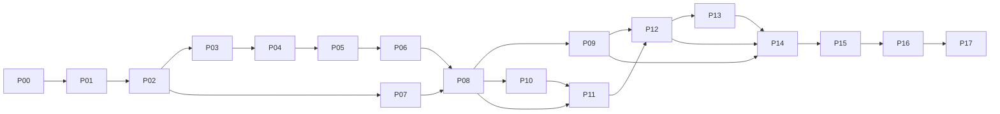

# Windows 사설 클라우드 기능·의존성·구현 순서

작성: 2026-10-02 · 상태: 구현 계획 · 실제 호스트 구축·검증 전

구성: **18단계 · 145개 세부 작업 · 사용자 결정/환경 확인 게이트 10개 · Cloud 인계 4개**. 각 작업에 선행 조건과 완료 증거를 연결했다.

이 문서는 [PMT 명세서](../../docs/projects/windows-private-cloud-lab/resources/derived/specification.md)의 요구사항과 D40~D57을 실행 작업으로 나눈다. **기존 사용자 결정은 유지하며, 아래 작업 분해·기본안·구현 순서는 이번 제안이다.** 아직 사용자에게 남겨진 기술·환경 결정은 임의 확정하지 않는다.

현재 저장소에는 README, 기존 계획, UI 가이드와 목업이 있다. 실행 코드·자동화·실환경 검증 결과는 없다. 현재 접속한 개발 PC와 별도 64GB 실습 PC를 구분한다. 오래된 PHP 직접 호출·JWT·HMAC 설명보다 PMT의 새 Linux API·상호 TLS 계약을 우선한다.

## 1. 구현 범위와 최종 결과

| 구분 | 만들 결과 | 구현 담당 |
| --- | --- | --- |
| 환경 | 물리 호스트 점검, 단계별 자원 예산, 사설망·가상 스위치, VM 가동 프로필 | Windows |
| 단독 Compute | Windows Server의 중첩 Hyper-V, Rocky 수동 설치·독립 복제, VM 자동화 | Windows |
| 관리 | AD/DNS 1대, VMM/SQL 1대, Compute·Storage 등록과 권한 | Windows |
| 저장소 | Compute가 고객 VM 구성·VHDX를 사용하는 SMB 3 공유와 암호화 | Windows |
| 클러스터 | Compute 3대·Storage 3대의 실습, 장애·복구 기록 | Windows |
| 축소 전환 | 고객 VM·디스크를 보존해 독립 Compute 1대·Storage 1대로 이관 | Windows |
| 작업 API | IIS 수신부, 상호 TLS, 영속 작업 기록, VMM 작업자, 완료 통지 | Windows |
| 상태 계약 | MSSQL 읽기 객체, 작업·VM 상태 대조, 동기화 시각·오류 | Windows·Cloud 공동 |
| 고객 서비스 | 신청·조회·시작·중지·재시작·삭제·사양 변경·SSH 접근 | Windows 실행부 / Cloud 권한·화면 |
| 운영 | 재시작 복구, 중복 방지, 제한된 재시도, 로그·성능·백업·재현 절차 | Windows, 화면은 Cloud |
| 별도 프로젝트 | Linux 8대 이중화→4대, 로그인·소유권·MySQL·관리자 화면 | Cloud |

가상 청구·결제·알림, Linux DB 이중화 구현, VPC 제품 구현은 Windows의 기능 목록에 넣지 않는다. DPM·SCOM 제품 도입도 필수 범위에 자동 추가하지 않는다. 필요한 환경을 확보하고 별도 범위를 정한 뒤 확장한다.

### 배치·가동 모드

| 모드 | 물리 Hyper-V 위의 인프라 VM | 물리 Hyper-V 위의 Linux 서비스 VM | 중첩 고객 VM |
| --- | --- | --- | --- |
| 단독 시험 | Compute 1, 이후 관리 VM을 순차 추가 | 통신 시험에 필요한 승인된 시험 클라이언트만 | Rocky 설치용·복제 시험용 |
| 인프라 클러스터 | AD/DNS 1 + VMM/SQL 1 + Compute 3 + Storage 3 = 8 | Linux 8대 시험은 중지 | 검증에 필요한 최소 수 |
| Linux 이중화 | 인프라 시험을 중지하고 의존 서비스를 정리 | 고객 콘솔 2 + 관리자 콘솔 2 + API 2 + MySQL 2 = 8 | 정지 |
| 서비스 | AD/DNS 1 + VMM/SQL 1 + Compute 1 + Storage 1 = 4 | 고객 콘솔·관리자 콘솔·API·MySQL 각 1 = 4 | 회원 신청으로 새로 생성 |

**8대·4대는 인프라 VM 수이며 중첩 고객 VM 수를 포함하지 않는다.** Linux 서비스 VM은 VMM 관리 대상이 아니다. 단일 물리 PC의 전원·디스크 장애 내성은 검증 범위 밖이다.

## 2. 순서를 결정하는 기술 조건

1. **물리 자원 확인이 첫 단계다.** 중첩 Hyper-V는 CPU와 VM 구성 버전에 따라 조건이 달라지고, 내부 Hyper-V가 실행 중인 Compute의 메모리를 일반 VM처럼 동적으로 조정한다고 가정할 수 없다. Compute는 고정 메모리를 기본안으로 두고 실측한다. [Microsoft 설정 조건](https://learn.microsoft.com/en-us/windows-server/virtualization/hyper-v/enable-nested-virtualization), [중첩 가상화 제약](https://learn.microsoft.com/en-us/windows-server/virtualization/hyper-v/nested-virtualization)
2. **Compute 클러스터는 실습 결과만 기록한다.** Microsoft는 중첩 가상화를 Windows Server Failover Clustering에 적합하지 않은 구성으로 설명한다. 정상 동작·실패·미검증을 구분하며 운영 지원 구성이라고 표시하지 않는다. [Microsoft 적용 범위](https://learn.microsoft.com/en-us/windows-server/virtualization/hyper-v/nested-virtualization)
3. **Storage는 별도 검증 대상이다.** S2D 게스트 클러스터 문서는 2~3노드, 노드별 최소 2개의 데이터 가상 디스크, 캐시 없는 구성을 제시한다. 한 물리 호스트에서는 문서의 물리 장애 도메인 분산 조건을 충족하지 못한다. 호스트 수준 디스크 스냅샷·복원을 S2D 백업으로 사용하지 않는다. [Microsoft S2D 게스트 조건](https://learn.microsoft.com/en-us/windows-server/storage/storage-spaces/storage-spaces-direct-in-vm)
4. **Storage 3→1은 데이터 이관이다.** S2D 구성이라면 3노드 중 2노드가 정지할 때 가상 디스크가 오프라인이 될 수 있다. 클러스터와 무관한 목적지 디스크·SMB 공유와 복구본을 먼저 확보해야 한다. [Microsoft S2D 게스트 조건](https://learn.microsoft.com/en-us/windows-server/storage/storage-spaces/storage-spaces-direct-in-vm)
5. **VMM 설치 조합을 고정한 다음 연동한다.** 현재 후보는 Windows Server 2022·VMM 2022·SQL Server 2022다. SQL Server 2022 지원은 VMM 2022 UR1부터이며 에디션·누적 업데이트·설치 구성은 다시 확인한다. VMM 서버는 도메인에 가입하고 Compute와 별도 VM에 둔다. [Microsoft VMM 2022 요구사항](https://learn.microsoft.com/en-us/system-center/vmm/system-requirements?preserve-view=true&view=sc-vmm-2022)
6. **Rocky 10의 실행과 제품 지원은 별개로 확인한다.** x86-64-v3 CPU 조건을 L2 게스트에서 확인한다. Hyper-V 부팅 성공이 VMM의 Rocky 10 게스트 에이전트·템플릿 공식 지원을 뜻하지 않는다. 지원 목록과 이미지 복제 시험을 별도로 남긴다. [Rocky 10 공식 릴리스](https://docs.rockylinux.org/latest/releases/release_notes/10_0/)

## 3. 구현 순서와 단계 의존성

**권장 실행 순서: P00 → P01 → P02 → P03 → P04 → P05 → P06 → P07 → P08 → P09 → P10 → P11 → P12 → P13 → P14 → P15 → P16 → P17.**

이는 번호 순서대로 진행할 때 모든 선행 조건이 충족되는 실행 순서다. 아래의 선행 단계는 반드시 완료해야 하는 최소 의존성이다. 사용자 결정 게이트는 해당 작업을 실행하기 직전에 통과한다.

| 단계 | 결과 | 선행 단계 | 다음 단계로 넘어가는 기준 |
| --- | --- | --- | --- |
| P00 | 기준·설정·계약 틀 | 없음 | 최신 요구사항과 실행 범위가 연결됨 |
| P01 | 실습 호스트·제품·자원 판정 | P00 | 모드별 RAM·디스크·버전의 실행 가능 판정 |
| P02 | 사설망·이름·접근 경로 | P01 | 관리·스토리지·고객 SSH 통신표 검증 |
| P03 | 단독 Compute | P02 | 중첩 Hyper-V에서 게스트 생성 가능 |
| P04 | Rocky 표준 이미지 | P03 | 서로 다른 신원의 복제 VM 2대 검증 |
| P05 | Hyper-V 직접 자동화 | P04 | 생성·조회·정리·중복·부분 실패 검증 |
| P06 | 초기 IIS·작업 실행 기반 | P05 | 인증된 시험 요청과 재시작 복구 검증 |
| P07 | AD/DNS·서비스 신원 | P02 | 이름·시간·도메인·권한 검증 |
| P08 | SQL·VMM·Compute 등록 | P06, P07 | VMM 공식 명령으로 시험 VM 제어 |
| P09 | VMM API·상태·통지 | P08 | IIS 이전, 영속 작업·MSSQL·통지 계약 검증 |
| P10 | Storage 3대·SMB 저장소 | P08 | Compute의 암호화된 파일 접근·복구 검증 |
| P11 | Compute 3대 클러스터 | P08, P10 | VM 이동·장애·복구·데이터 대조 |
| P12 | 인프라 8→4 보존 전환 | P09, P11 | 독립 Compute·Storage에서 기존 데이터 유지 |
| P13 | Linux 8대 별도 검증·4대 인계 | P12 | Cloud 검증 결과와 연결 설정 인계 |
| P14 | 첫 회원 VM 생성·접근 | P09, P12, P13 | 신청부터 새 Rocky VM SSH까지 일치 |
| P15 | VM 전체 수명주기 | P14 | 전원·삭제·사양 변경을 포털부터 검증 |
| P16 | 운영 상태·장애 복구 종합 | P15 | 단절·중복·재시작·인증서 교체 검증 |
| P17 | 재현·백업 복원·최종 인계 | P16 | 정리된 절차로 재구축·복원 성공 |

인프라 검증을 Linux 검증보다 먼저 배치한 이유는 Windows API·인증서·MSSQL 계약을 먼저 고정해 Cloud의 재작업을 줄이기 위해서다. 두 8대 환경의 동시 시험은 하지 않는다. 코드·문서 작업은 P07과 P03~P06, P09와 P10~P11에서 병행 가능하지만 실제 VM 가동은 P01 자원표를 따라야 한다. MSSQL 조회 대상 결정이 늦어져도 이미 준비된 VMM으로 Storage·Compute 클러스터 시험은 진행할 수 있다.

## 4. 세부 기능과 작업 목록

각 행은 착수 가능한 작업 단위다. `선행`의 모든 작업·게이트가 충족되어야 한다. 게이트는 5절, 외부 인계 X01~X04는 7절에 정의한다. 표의 성공 기준은 앞으로 확보할 증거이며 현재 완료를 뜻하지 않는다.

### P00. 요구사항·설정·검증 기반

| ID | 작업 | 선행 | 완료 증거 |
| --- | --- | --- | --- |
| P00-01 | 최신 PMT 결정·요구사항을 모으고 PHP·JWT·HMAC 폐기 경로를 표시한다. | 없음 | 적용/대체/미정 목록 |
| P00-02 | L0 물리 호스트, L1 인프라·Linux, L2 고객 VM의 이름·ID 규칙을 만든다. | P00-01 | 역할별 배치표와 식별자 정의 |
| P00-03 | 공통 설정 스키마를 만든다. 제품·역할·경로·프로필·네트워크·허용 작업을 비밀값과 분리한다. | P00-02 | 예제 설정과 누락·잘못된 값 거부 |
| P00-04 | 단독·인프라8·Linux8·서비스4+4 가동 프로필과 상호 배제 규칙을 정의한다. | P00-03 | 모드별 VM 목록·전환 조건 |
| P00-05 | 요청·작업·VM·이벤트·오류 계약 초안과 버전 필드를 만든다. | P00-01 | 6절 계약의 필수 필드·상태 정의 |
| P00-06 | 증거 형식·마스킹·시각·검증 명령 기록을 정하고 수동/모의/실측을 구분한다. | P00-03, G10 | JSON 원본·Markdown 요약 연결 예시 |
| P00-07 | 환경 읽기와 변경을 분리하고 점검·실행·결과 대조의 공통 진입점을 만든다. | P00-03, P00-06 | 점검 모드의 무변경 확인 |
| P00-08 | 변경 전 조건·변경 후 확인·중단·복구 형식을 각 작업에 적용한다. | P00-05, P00-07 | 첫 구현 작업 지시서 |

### P01. 물리 호스트·제품·자원 판정

| ID | 작업 | 선행 | 완료 증거 |
| --- | --- | --- | --- |
| P01-01 | 별도 실습 PC에서 Windows 에디션·빌드, CPU, 가상화 확장, Hyper-V 상태를 수집한다. | P00-08, G01 | 호스트 점검 결과 |
| P01-02 | 디스크별 실제 여유 공간·파일시스템·IO 지연, 물리 RAM·상시 사용량을 측정한다. | P01-01 | 유휴·기본 부하 측정표 |
| P01-03 | 물리 NIC·가상 스위치·기존 NAT·DHCP·DNS·방화벽을 읽고 충돌 후보를 표시한다. | P01-01 | 변경 전 네트워크 목록 |
| P01-04 | OS·VMM·SQL·ADK·런타임·드라이버의 버전·에디션·사용 권한·공식 지원표를 고정한다. | P01-01, G02 | 설치 매체 해시·버전 조합표 |
| P01-05 | 8대/4+4/전환 모드의 메모리·CPU·저장소·임시 복사 공간을 계산한다. | P01-02, P00-04 | 8절 자원표와 여유 기준 |
| P01-06 | 부팅·이미지 복사·스토리지 복구 시의 순간 부하까지 시험할 측정 시나리오를 만든다. | P01-05 | 단계별 시작·중단 임계값 |
| P01-07 | 자원 부족 시 배정·가동 순서 조정안을 제시하고 가능/불가를 판정한다. | P01-03, P01-04, P01-06 | 실행 가능한 환경 프로필 |

### P02. 네트워크·주소·접근 경로

| ID | 작업 | 선행 | 완료 증거 |
| --- | --- | --- | --- |
| P02-01 | 관리·SMB·클러스터·고객·Linux VIP의 연결을 주소와 별개로 설계한다. | P01-07 | 송신자→수신자·목적 표 |
| P02-02 | 중첩 MAC 전달·NAT 등 선택지와 고객 직접 SSH·이동 시 주소 유지 조건을 실습 환경에 대조한다. | P02-01 | 공식 자료·호스트 조건·선택지 |
| P02-03 | 사용자 지정 스위치·서브넷·고정 IP·라우팅·DNS·시간 원천을 비공개 설정에 넣는다. | P02-02, G03 | 중복 주소·잘못된 경로 검사 |
| P02-04 | 물리/중첩 스위치를 준비하고 원격 접속 단절 시 로컬 복구 절차를 둔다. | P02-03 | 관리 접속 유지와 되돌리기 시험 |
| P02-05 | AD·VMM·SMB·IIS·SQL·SSH의 포트/방향/출발지 허용표를 만든다. 제품 관리 트래픽과 고객 데이터 접근을 구분한다. | P02-03, P01-04 | 필요한 통신 허용·불필요 통신 거부 |
| P02-06 | 고객 단말에서 중첩 VM으로 가는 경로를 시험한다. 주소 예약·해제 주체와 중복 방지를 정한다. | P02-04, P02-05 | SSH까지의 경로 검증 계획·주소 수명주기 |
| P02-07 | Linux8 시험 때 인프라 정지로 DNS·시간·인증서 검증이 끊기지 않게 독립 의존성을 정리한다. | P02-05, P00-04 | 모드별 DNS·시간·신뢰 경로 |
| P02-08 | 서비스4+4에서 VIP 유지 여부와 실제 API 출발지 IP를 확인한다. VIP와 송신 IP를 같은 값으로 가정하지 않는다. | P02-06, P02-07 | Cloud에 전달할 네트워크 계약 |

VMM의 방화벽 요구에는 관리·파일 전송과 동적 포트 범위가 포함된다. 443 하나만 열어 끝내지 않고 설치 버전에 맞춰 필요한 출발지만 허용한다. [Microsoft VMM 통신 목록](https://learn.microsoft.com/en-us/system-center/vmm/plan-ports-protocols?view=sc-vmm-2022)

### P03. 단독 Compute 구축

| ID | 작업 | 선행 | 완료 증거 |
| --- | --- | --- | --- |
| P03-01 | 이름·세대·CPU·고정 RAM·OS 디스크·NIC가 명시된 Compute VM을 만든다. | P02-08 | 물리 Hyper-V 설정 조회 |
| P03-02 | VM을 종료한 상태에서 가상화 확장을 노출하고 설치된 CPU 기능을 확인한다. | P03-01 | 설정·게스트의 가상화 기능 일치 |
| P03-03 | Windows Server 설치·업데이트·이름·시간·네트워크를 설정한다. | P03-02 | 재부팅 후 기본 상태 |
| P03-04 | 내부 Hyper-V 역할·관리 도구를 설치하고 중첩 스위치를 연결한다. | P03-03 | 내부 Hyper-V 점검 통과 |
| P03-05 | 허용 저장 루트·관리 계정·실습 전용 VM 식별 표식을 만든다. | P03-04 | 관리 가능 범위와 외부 경로 거부 |
| P03-06 | 외부 Compute와 내부 게스트의 시작·정지 의존성을 확인한다. | P03-05 | 외부 재부팅 후 내부 상태 기록 |

### P04. Rocky 이미지·고객 VM 초기화

| ID | 작업 | 선행 | 완료 증거 |
| --- | --- | --- | --- |
| P04-01 | 공식 Rocky 10 ISO와 체크섬을 받아 버전·아키텍처·무결성을 기록한다. | P03-06 | 공식 다운로드·해시 일치 |
| P04-02 | L2 CPU 기능·Gen2 부팅·Secure Boot 설정을 확인하고 수동 설치한다. | P04-01 | Rocky 부팅·CPU 요구 충족 |
| P04-03 | 네트워크·DNS·시간·Hyper-V 통합 기능·정상 종료·SSH를 시험한다. | P04-02, P02-06 | IP와 고객 단말 SSH 기록 |
| P04-04 | 기본 계정·공개키 주입·호스트명·고유 machine-id·SSH 호스트키 초기화 절차를 만든다. | P04-03 | 복제 시 신원 재생성 절차 |
| P04-05 | 전체 VHDX 복제 기본안과 초기화 전달 방식의 적합성을 시험한다. 공유 부모에 의존하는 방식은 별도 검증한다. | P04-04 | 이미지 방식 선택 근거 |
| P04-06 | 템플릿을 동결하고 imageId·버전·해시·최소 디스크·지원 프로필·초기화 버전을 등록한다. | P04-05 | 이미지 명세·원본 보호 |
| P04-07 | 독립 복제 VM 2대를 만들고 IP·MAC·machine-id·SSH 호스트키가 충돌하지 않는지 확인한다. | P04-06 | 서로 다른 신원과 각각의 SSH 성공 |
| P04-08 | 재부팅·반복 초기화·원본 변경 거부를 시험하고 설치용 VM을 정지한다. | P04-07 | 재사용 가능한 이미지와 정리 기록 |

### P05. Hyper-V 직접 작업 자동화

| ID | 작업 | 선행 | 완료 증거 |
| --- | --- | --- | --- |
| P05-01 | 프로필·이미지·네트워크 ID를 실제 사양·경로로 변환하는 허용 목록을 만든다. | P04-08, P00-05 | 임의 명령·경로·스위치 입력 거부 |
| P05-02 | VM 조회·존재 확인·실제 사양·디스크·네트워크 조회를 공통 함수로 만든다. | P05-01 | 수동 조회값과 구조화 결과 일치 |
| P05-03 | 용량·파일·주소·동시 작업을 사전 검사하고 서버가 VM 이름·디렉터리를 만든다. | P05-02 | 준비 실패 시 자원 미생성 |
| P05-04 | 이미지 복사→VM 생성→NIC/사양 설정→초기화→기동→재조회를 구현한다. | P05-03 | 새 VM 1대와 요청 ID 연결 |
| P05-05 | 생성 도중 단계별 실패를 삽입하고 이 요청이 만든 자원만 추적한다. | P05-04, G08 | 잔여 파일·VM 목록 및 복구 분류 |
| P05-06 | 같은 요청 반복·다른 내용의 같은 키·동시 요청을 구분한다. | P05-05 | 중복 VM 0개·충돌 명시 |
| P05-07 | 시험 자원 삭제와 디스크 보존/제거를 분리하고 경로·참조·소유 표식을 검증한다. | P05-06, G08 | 타 VM·템플릿에 영향 없는 정리 |
| P05-08 | 시작·정상 중지·재시작의 기본 명령과 전원 상태별 동작표를 만든다. | P05-02 | 상태 재조회·실패 코드 |
| P05-09 | 수동 작업과 자동화의 VM ID·CPU·RAM·VHDX·스위치·부팅 결과를 대조한다. | P05-07, P05-08 | 반복 시험 결과와 차이 0건 또는 원인 |

### P06. 초기 IIS·인증·영속 작업 실행

| ID | 작업 | 선행 | 완료 증거 |
| --- | --- | --- | --- |
| P06-01 | IIS 구현 후보·작업자 실행 모델·PowerShell 호환성을 비교하고 시험 요청 주체를 정한다. | P05-09, G04 | 선택된 기술·프로세스·시험 호출자 |
| P06-02 | 오프라인 CA 운영, 서버/클라이언트 인증서 용도·이름·신뢰·폐기·갱신 절차를 구성한다. | P06-01, G05 | 발급·신뢰·키 접근권한 기록 |
| P06-03 | Compute의 IIS 시험 엔드포인트에 HTTPS·클라이언트 인증·출발지 제한을 적용한다. | P06-02 | 허용 호출 성공·무인증/잘못된 IP 거부 |
| P06-04 | 수신 검증·영속 접수·작업 ID 반환을 구현한다. 응답 전에 접수를 저장한다. | P06-03, P00-05 | 응답 유실 후 같은 작업 ID 복구 |
| P06-05 | 전용 작업자를 웹 요청과 분리하고 작업 점유·동시 실행 제한·심박·재시작 복구를 만든다. | P06-04 | IIS 재순환에도 접수 작업 유지 |
| P06-06 | 고정 작업·타입 검증 인수만 PowerShell로 전달하고 표준 결과·오류를 받는다. | P06-05, P05-09 | 명령 삽입 입력 거부·정상 생성 |
| P06-07 | 타임아웃을 관측 실패와 실제 작업 실패로 구분하고 기존 VM·작업을 재조회한다. | P06-06 | 응답 단절 후 중복 실행 방지 |
| P06-08 | 로그 마스킹·요청 크기·호출 빈도·큐 상한·상태 점검을 적용한다. | P06-07 | 과부하 거부와 진단 기록 |
| P06-09 | 성공·부분 실패·동시 요청·웹 재시작을 시험하고 VMM 이전 패키지를 준비한다. | P06-08 | 배포 설정과 시험 결과 묶음 |

IIS 수신부의 비교 기본안은 **ASP.NET Core 수신부 + 별도 PowerShell 작업자**다. 공식 IIS 호스팅·클라이언트 인증서 연동 경로가 있으나 런타임 버전과 실행 방식의 최종 선택은 G04를 따른다. VMM 모듈을 최신 PowerShell에 그대로 로드할 수 있다고 가정하지 않고 설치 버전의 실행 환경을 시험한다. [Microsoft IIS 호스팅](https://learn.microsoft.com/en-us/aspnet/core/host-and-deploy/iis/), [Microsoft 인증서 인증](https://learn.microsoft.com/en-us/aspnet/core/security/authentication/certauth)

### P07. AD/DNS·시간·계정

| ID | 작업 | 선행 | 완료 증거 |
| --- | --- | --- | --- |
| P07-01 | AD/DNS VM을 만들고 도메인명·고정 주소·복구 정보·기본 백업을 설정한다. | P02-08, G02 | 도메인·DNS 정상 확인 |
| P07-02 | Windows 인프라의 이름 해석·도메인 가입·시간 계층을 구성한다. | P07-01 | 각 노드의 이름·시간·신뢰 확인 |
| P07-03 | IIS 수신, PowerShell 작업, VMM 서비스/Run As, SQL 읽기, 통지 신원을 분리한다. | P07-02 | 신원별 필요 권한표 |
| P07-04 | 자격 증명·개인키·작업 디렉터리를 각 서비스에 필요한 권한으로 제한한다. | P07-03 | 허용 계정 성공·다른 계정 거부 |
| P07-05 | AD/DNS 일시 정지·시간 오차 때의 진단과 시작 순서를 정한다. | P07-04 | 인증 장애의 명확한 오류·복구 |
| P07-06 | 서비스 계정 교체와 AD 복원 절차를 문서화한다. | P07-05 | 비밀값 없는 운영 절차 |

### P08. SQL·VMM 설치와 Compute 등록

| ID | 작업 | 선행 | 완료 증거 |
| --- | --- | --- | --- |
| P08-01 | VMM/SQL VM을 만들고 도메인 가입·선택 버전의 설치 전제 조건을 충족한다. | P06-09, P07-06 | 설치 전 검사 통과 |
| P08-02 | SQL을 설치하고 인스턴스·정렬 규칙·서비스 계정·메모리 상한·백업 경로를 검증한다. | P08-01 | SQL 기본 상태·VMM 설치 요건 |
| P08-03 | VMM을 설치·업데이트하고 콘솔·PowerShell·라이브러리를 확인한다. | P08-02 | 버전·모듈·연결 증거 |
| P08-04 | 시험 Compute를 Run As 등 제품 요구에 맞게 등록하고 호스트·스위치·저장 경로를 조회한다. | P08-03, P03-06 | VMM에서 실제 Compute 인식 |
| P08-05 | Rocky 이미지의 라이브러리 등록·가상 디스크 복제·설정 주입을 VMM 경로로 시험한다. | P08-04, P04-08 | VMM에서 별도 Rocky VM 생성 |
| P08-06 | 작업 ID·VMM Job ID·Hyper-V VM ID를 연결하고 조회·시작·중지·정리를 대조한다. | P08-05 | 공식 명령·실제 VM 상태 일치 |
| P08-07 | VMM 장애·SQL 장애·권한 누락·호스트 미응답을 시험하고 자원 사용량을 다시 잰다. | P08-06 | 원인별 실패·복구와 갱신된 예산 |

### P09. VMM 수신부·상태 DB·완료 통지

| ID | 작업 | 선행 | 완료 증거 |
| --- | --- | --- | --- |
| P09-01 | Hyper-V 직접 실행과 VMM 실행을 같은 작업 계약 아래 별도 어댑터로 둔다. | P08-07 | 동일 입력·출력의 실행부 교체 시험 |
| P09-02 | 시험 접수를 잠그고 작업을 비운 뒤 IIS·작업자를 VMM VM으로 이전한다. 이전 주소·인증서·권한을 폐기/제한한다. | P09-01 | 중복 실행원 0개·VMM 주소 호출 성공 |
| P09-03 | VM별 직렬화·용량 예약·VMM Job ID 영속 기록을 연결한다. 관리 중인 VM 변경은 VMM으로 통일한다. | P09-02 | 동시 변경 충돌 거부·재시작 재조회 |
| P09-04 | VMM 내부 DB 읽기 계약과 별도 상태 DB 투영안을 비교해 실제 조회·업데이트 영향을 시험한다. | P09-03 | 공식 계약 확인 결과·두 안의 차이 |
| P09-05 | 사용자 선택에 따라 읽기 객체·필드·신선도·정합성·스키마 버전을 확정한다. 자동으로 DB 방식을 바꾸지 않는다. | P09-04, G06 | Linux API가 사용할 조회 계약 |
| P09-06 | SQL 서버 인증서 검증·전용 읽기 계정·객체 권한·출발지 제한을 적용한다. VMM 내부 테이블에는 사용자 코드를 쓰지 않는다. | P09-05, P06-02 | 읽기 성공·쓰기/비허용 객체/불신 인증서 거부 |
| P09-07 | 완료 판정 후 영속 통지함에 이벤트를 기록하고 API로 상호 TLS 전송한다. | P09-03, P09-05 | 결과 저장과 통지 예약의 원자성 |
| P09-08 | 통지 ID·작업 ID·VM ID·버전으로 중복·지연·역순·응답 유실을 처리한다. | P09-07 | 동일 이벤트의 단일 반영 |
| P09-09 | 작업·VMM·Hyper-V·SQL 조회·통지 결과를 대조하고 불일치와 미관측을 표시한다. | P09-06, P09-08 | DB 조회와 통지의 상태 일치 |
| P09-10 | 시험 클라이언트·시험 수신부로 계약을 검증하고 Cloud에 예제·오류·인증서 요구를 인계한다. | P09-09 | X01·X02에 필요한 계약 패키지 |

VMM Job 조회는 공식 PowerShell을 기준으로 검증한다. 페이지의 최신 예제가 설치한 VMM 버전과 같다고 가정하지 않는다. DB 조회 대상은 여전히 G06 사용자 결정이다. [Microsoft Get-SCJob](https://learn.microsoft.com/en-us/powershell/module/virtualmachinemanager/get-scjob)

### P10. Storage 3대·SMB 저장소

| ID | 작업 | 선행 | 완료 증거 |
| --- | --- | --- | --- |
| P10-01 | 3대 Storage의 클러스터 기술·OS 에디션·데이터 디스크·정족수·복원 방식을 비교·선택한다. | P08-07, G07 | 지원 조건·실습 제약·선택 결과 |
| P10-02 | 3대 VM에 OS와 데이터 디스크를 분리하고 도메인·네트워크·시간을 설정한다. | P10-01 | 노드별 장치·서비스 목록 |
| P10-03 | 클러스터 사전 검사를 수행하고 오류·경고·단일 물리 호스트 제약을 분리한다. | P10-02 | 검사 보고서·진행 판정 |
| P10-04 | 선택 기술로 Storage 클러스터·풀·볼륨·파일 서버 역할을 구성한다. S2D 선택 시 SOFS 구성을 검증한다. | P10-03 | 풀·볼륨·역할 정상 상태 |
| P10-05 | 고객 VM 전용 SMB 공유·필요한 공유/NTFS 권한·암호화·Compute 데이터 접근 제한을 적용한다. | P10-04 | 허용 노드 읽기/쓰기·다른 주체 거부 |
| P10-06 | VMM에 파일 서버·공유를 등록하고 Compute에 할당한다. 제품 관리용 예외가 필요하면 D54와 대조해 최소 범위를 결정한다. | P10-05, P08-04 | VMM 저장소 인식·접근 검사 |
| P10-07 | 시험 VM의 구성·VHDX를 SMB에 두고 생성·부팅·정지·재시작·삭제를 시험한다. | P10-06 | SMB 경로에서 실제 VM 동작 |
| P10-08 | Storage 노드 1대 정지·복귀, 링크 단절·권한 거부·용량 부족을 각각 시험한다. | P10-07 | 데이터 대조·복구 시간·원인별 결과 |
| P10-09 | 클러스터 밖 복구본과 단독 Storage 목적지의 독립 디스크를 준비하고 복사 용량을 실측한다. | P10-08 | 3→1 이관 사전 조건·복원 가능 확인 |

분리형 S2D 구성은 Compute 클러스터와 Storage 클러스터를 나누고 SOFS·SMB로 VM 파일을 제공하는 후보이다. VMM의 파일 서버 등록에는 제품 전용 계정·관리 접근이 필요할 수 있으므로 Compute 데이터 접근 규칙과 구분해 검증한다. [Microsoft 분리형 구성](https://learn.microsoft.com/en-us/system-center/vmm/s2d?view=sc-vmm-2022), [Microsoft 파일 저장소 등록](https://learn.microsoft.com/en-us/system-center/vmm/storage-file?view=sc-vmm-2025)

공유 암호화는 설정값뿐 아니라 실제 연결에서도 확인한다. [Microsoft SMB 보안](https://learn.microsoft.com/en-us/windows-server/storage/file-server/smb-security)

### P11. Compute 3대 클러스터·장애 시험

| ID | 작업 | 선행 | 완료 증거 |
| --- | --- | --- | --- |
| P11-01 | Compute 2·3을 재현 가능한 설정으로 만들고 도메인·Hyper-V·VMM에 편입한다. | P08-07, P10-09 | 3대 설정·버전·이름 일치 |
| P11-02 | 스위치 이름·네트워크·이미지·SMB 권한·노드별 여유 자원을 맞춘다. | P11-01 | VM 이동 대상의 사전 조건 |
| P11-03 | Failover Cluster 사전 검사와 실습 진행 판정을 기록한다. | P11-02 | 실패·경고·지원 한계를 포함한 결과 |
| P11-04 | Compute 클러스터·정족수/감시 구성·네트워크 역할을 설정하고 VMM에서 확인한다. | P11-03 | 3노드 멤버십·공유 접근 |
| P11-05 | SMB에 저장된 시험 VM을 클러스터 관리 대상으로 만들고 계획된 이동을 시험한다. | P11-04 | 이동 전후 ID·디스크·IP·SSH 대조 |
| P11-06 | Compute 1대 정지, 역할 이동, 복귀를 각각 시험한다. | P11-05 | 실제 중단·복구 시간과 데이터 유지 |
| P11-07 | Storage 장애와 Compute 장애를 따로 시험한 뒤 통제된 조합만 추가한다. | P11-06, P10-08 | 장애 범위·원인·복구의 분리 기록 |
| P11-08 | 재동기화·클러스터 정상 복귀·잔여 자원·이벤트를 점검한다. | P11-07 | 정상 기준선 복원 |
| P11-09 | 8대 인프라 모드 자원 실측과 실습 보고서를 고정한다. | P11-08 | 성공/실패/미검증 및 4대 전환 입력 |

### P12. 데이터 보존과 인프라 8→4 전환

| ID | 작업 | 선행 | 완료 증거 |
| --- | --- | --- | --- |
| P12-01 | 남길 Compute·Storage, 고객 VM·디스크·ID·경로·키·IP·파일 참조를 목록화한다. | P11-09 | 전환 전 자산 명세 |
| P12-02 | 작업 접수를 잠그고 실행 중 작업·통지를 정리한다. 정지 시간과 되돌릴 시점을 명시한다. | P12-01, P09-10 | 신규 작업 차단·작업 중복 0개 |
| P12-03 | 고객 VM을 정상 종료하고 게스트 데이터·VM 설정·VHDX의 일관된 복구본을 검증한다. | P12-02, P10-09 | 복원 시험·체크섬·파일 수 대조 |
| P12-04 | 클러스터 데이터 디스크와 독립된 단독 Storage 디스크·파일시스템·SMB 공유를 준비한다. | P12-03 | 클러스터 정지와 무관한 공유 |
| P12-05 | 정지된 VM·디스크를 목적지로 복사하고 체크섬·권한·부모 디스크 의존성을 검사한다. | P12-04 | 전체 파일·데이터 일치 |
| P12-06 | 남길 Compute를 단독 운영 상태로 전환하고 VM 등록·저장 경로·스위치·권한을 복원한다. | P12-05 | 단독 Compute의 VM 인식 |
| P12-07 | VMM의 호스트·공유·VM 참조와 요청 매핑을 갱신한다. ID가 바뀌면 이전→신규 매핑을 원자적으로 기록한다. | P12-06 | 유실·중복 VM 참조 0개 |
| P12-08 | 기존 고객 VM 부팅·SSH·파일 내용·전원 제어를 확인하고 실패 시 복구본으로 되돌린다. | P12-07 | 전환 전후 게스트 데이터 일치 |
| P12-09 | 추가 Compute·Storage 각 2대를 종료하고 자동 시작·예약 작업·재가입으로 되살아나지 않게 한다. | P12-08 | 추가 4대 정지·자동 시작 차단 |
| P12-10 | 물리 호스트 재부팅 후 인프라 4대의 순차 기동·SMB·VMM·고객 VM 복구를 확인한다. | P12-09 | 재부팅 후 가동 대수·데이터·서비스 확인 |

기본 이관안은 **정지 → 일관된 복사/복구본 → 독립 SMB 목적지 → 단독 Compute 등록 → 데이터 대조 → 추가 노드 정지**다. 목적지 디스크를 S2D 풀에 포함하지 않는다. 되돌릴 수 있다는 검증 없이 기존 풀·원본을 해체하지 않는다. 실제 명령과 VMM의 클러스터 해제·재등록 순서는 시험 VM으로 먼저 검증한다.

### P13. Linux8 단독 시험과 Linux4 인계 — Cloud 외부 의존성

| ID | 작업 | 선행 | 완료 증거 |
| --- | --- | --- | --- |
| P13-01 | 인프라 작업·VM을 정상 정리하고 Linux8 모드의 자원·DNS·시간 의존성을 확인한다. | P12-10, P02-07 | 두 8대 환경의 동시 가동 없음 |
| P13-02 | Cloud 측 Linux 8대·Keepalived·배포·DB 전환 시험 결과를 인계받는다. | P13-01, X03 | Cloud의 별도 완료 증거 |
| P13-03 | 고객 콘솔·관리자 콘솔·API·MySQL 각 1대로 축소한 주소·인증서·DB 접근 정보를 받는다. | P13-02 | 서비스 모드의 4개 역할 |
| P13-04 | 나머지 Linux 4대 자동 시작을 제한하고 인프라4를 다시 순서대로 기동한다. | P13-03 | 4+4 가동 목록·자원 실측 |
| P13-05 | API→VMM·API→MSSQL·VMM→API 및 고객 SSH 경로를 실환경에서 시험한다. | P13-04, X01, X02 | 양방향 신원·IP·이름 검증 |

Windows는 이 단계에서 Linux의 회원·DB·VIP 구현을 대신 만들지 않는다. Cloud의 실제 완료 증거가 없으면 연결 전까지 Windows 계약 시험만 완료로 표시한다.

### P14. 첫 회원 신청부터 Rocky SSH까지

| ID | 작업 | 선행 | 완료 증거 |
| --- | --- | --- | --- |
| P14-01 | 테스트 관리자·회원 2명, 이미지 1개·프로필 1개·네트워크 1개·VM 상한을 준비한다. | P09-10, P12-10, P13-05, X04 | 공동 시험 입력표 |
| P14-02 | 회원 신청→Cloud 요청 ID→IIS 접수→작업자→VMM Job→Hyper-V VM 연결을 실행한다. | P14-01 | 요청부터 생성까지 추적 가능 |
| P14-03 | 접수 응답과 완료를 나누고 실제 VM의 CPU·RAM·디스크·상태를 재조회한다. | P14-02 | 신청 사양과 실제 값 일치 |
| P14-04 | 완료 통지와 페이지 로드 MSSQL 조회를 비교하고 지연·오래된 값을 표시한다. | P14-03 | 화면·조회 객체·실제 VM 일치 |
| P14-05 | 초기화 완료·게스트 IP·SSH 호스트키 지문을 확인하고 콘솔에서 고객에게 접속 정보를 제공한다. | P14-04 | 새 VM에 고객 공개키로 SSH 성공 |
| P14-06 | 다른 회원의 조회·조작, 위조된 VM ID·프로필·공개키 입력을 거부한다. | P14-05 | Cloud 소유권·Windows 대상 제한 검증 |
| P14-07 | 중복 클릭·응답 유실·이미지 누락·용량 부족·통지 단절을 재현한다. | P14-06 | 중복 VM 없음·거짓 성공 없음 |
| P14-08 | 신청 지연·프로비저닝 시간·SSH 준비 시간을 별도 기록하고 첫 결과를 고정한다. | P14-07 | 회원 신청으로 만든 별도 VM의 증거 |

설치용 Rocky VM을 첫 회원 VM으로 재사용하지 않는다. 성공 결과에는 회원 신청으로 새로 만들어진 VM의 식별자가 있어야 한다.

### P15. VM 전체 수명주기·사양 변경

| ID | 작업 | 선행 | 완료 증거 |
| --- | --- | --- | --- |
| P15-01 | 허용 전원 상태·동시 동작·정상 종료 시간·강제 동작의 정책을 고정한다. | P14-08, G08 | 동작×현재 상태 표 |
| P15-02 | 시작을 연결한다. 이미 실행 중인 요청은 중복 기동하지 않고 실제 상태를 반환한다. | P15-01 | 시작 전후 상태·통지·화면 |
| P15-03 | 정상 중지를 연결한다. 게스트 종료 실패 시 정책 없이 강제 전원 끄기로 넘어가지 않는다. | P15-02 | 정상 종료·시간 초과 구분 |
| P15-04 | 재시작을 연결하고 일시적인 실행 상태만으로 재부팅 완료를 판정하지 않는다. | P15-03 | 게스트 부팅 시각·접근 복구 |
| P15-05 | 삭제 전 대상·소유권·실행 작업·디스크 참조를 확인하고 VM 등록과 디스크 제거를 분리한다. | P15-04 | 삭제 정책·복구 가능 범위 |
| P15-06 | 삭제·주소 해제·상태 묘비 기록·통지와 반복 삭제의 멱등 처리를 연결한다. | P15-05 | 잔여 자원·공유 이미지 손상 0개 |
| P15-07 | CPU·메모리 변경을 정지 상태 기본안으로 구현하고 재기동 후 적용값을 검사한다. | P15-04, G08 | 변경 사양과 실제 값 일치 |
| P15-08 | 디스크 확장과 게스트 파티션/파일시스템 확장을 별도 단계로 처리한다. 축소는 별도 검증 전 거부한다. | P15-07 | VHDX 크기·게스트 사용 가능 용량 대조 |
| P15-09 | 네트워크 변경의 주소 예약·게스트 설정·연결 단절·재접속·원복을 구현한다. | P15-07, P02-06, G03 | 이전 주소 해제·신규 SSH·원복 증거 |
| P15-10 | 시작/삭제·변경/변경·재시작/중지 등 충돌과 Cloud 권한을 전체 동작에서 시험한다. | P15-06, P15-08, P15-09 | VM별 한 작업·요청별 상태 일치 |

### P16. 운영 상태·보안·장애 복구 종합

| ID | 작업 | 선행 | 완료 증거 |
| --- | --- | --- | --- |
| P16-01 | 호스트·VM·작업·SMB·용량·인증서·마지막 관측 시각의 읽기 모델을 완성한다. | P15-10, G09 | 관리자 화면 공급 데이터 |
| P16-02 | 실제 상태/요청 상태/동기화 지연을 구분하고 오래된 값·단절·불일치 경보를 만든다. | P16-01 | stale·unknown·failed 구분 |
| P16-03 | Compute·Storage·VMM/SQL·L0 자원 지표와 작업 지연을 수집한다. 중첩 자원을 이중 합산하지 않는다. | P16-02 | G09에 맞는 수집·보관·표시 |
| P16-04 | 작업자 종료·IIS 재순환·VMM/SQL 재시작 후 미완료 작업을 재조회·인계한다. | P16-03 | 유실 작업·중복 실행 0개 |
| P16-05 | 통지 유실·중복·역순·장시간 단절·SQL 조회 실패의 재시도와 수동 재처리를 시험한다. | P16-04 | 잘못된 성공 전이 없음 |
| P16-06 | 인증서 만료·불신 CA·이름 오류·폐기·키 권한 오류·출발지 변경을 시험한다. | P16-05 | 인증 실패·진단·정상 복원 |
| P16-07 | 서버·클라이언트 인증서와 서비스 자격 증명을 교체하고 이전 신원 거부를 확인한다. | P16-06 | 교체 전후 신뢰·접속 결과 |
| P16-08 | 자원 고갈·큐 적체·주소 고갈·보관 로그 증가 시 제한과 복구를 시험한다. | P16-07 | 사전 거부·원인·회수 절차 |
| P16-09 | Cloud 관리자 콘솔의 실습 단계·증거·상태·가상 데이터 표기를 실제 결과에 연결한다. | P16-08, X04 | 관리자 화면과 Windows 증거 일치 |

### P17. 재현·백업 복원·최종 인계

| ID | 작업 | 선행 | 완료 증거 |
| --- | --- | --- | --- |
| P17-01 | 설정·모듈·이미지·설치 매체·DB 변경의 버전과 해시를 고정한다. | P16-09 | 재현 가능한 배포 목록 |
| P17-02 | 한 단계씩 재실행해 이미 적용된 상태를 검출하고 실패 지점부터 복구한다. | P17-01 | 재실행 시 중복 구성 없음 |
| P17-03 | AD·SQL/VMM·작업 기록·이미지·고객 VM·인증서별 백업 대상과 복원 순서를 실행 검증한다. | P17-02 | 격리된 복원 시험 |
| P17-04 | 물리 호스트 재시작 후 AD→Storage→VMM/Compute→고객 VM→API 준비 상태를 확인한다. | P17-03 | 서비스 준비에 근거한 순차 복구 |
| P17-05 | Windows8·Linux8·서비스4+4 모드 간 전환과 자동 시작 제한을 최종 재검증한다. | P17-04 | 가동 대수·보존 데이터·접근 결과 |
| P17-06 | 모든 요구사항을 구현·시험·미검증·보류로 분류하고 원인·후속 작업을 남긴다. | P17-05 | 9절 요구사항 추적표 갱신 |
| P17-07 | 설치·운영·장애·복원 절차와 공개 가능한 증거를 정리하고 완료 판정을 한다. | P17-06 | 새 실행자가 재현 가능한 인계본 |

## 5. 구현 직전에 통과할 결정 게이트

지금 계획을 작성하는 데 아래 답변이 모두 필요한 것은 아니다. **미정 값은 계획에 남기고, 해당 기능을 실제 구현·구성할 때 결정한다.** 기존 명세가 사용자 선택으로 남긴 사항은 기본안만 제시한다.

| ID | 결정·확인할 것 | 제안 기본안 / 바꿀 조건 | 최초 차단 작업 |
| --- | --- | --- | --- |
| G01 | 별도 실습 PC의 접근 방법·CPU·RAM·저장 장치·실제 사용 가능량 | 읽기 전용 점검 결과로 예산 작성. 부족하면 VM 배정·단계 조정 | P01-01 |
| G02 | OS/VMM/SQL 에디션·업데이트·ADK·설치 매체·사용 권한 | 기존 2022 조합을 먼저 검증. 지원·설치·사용 조건 불충족 시 조합 재선택 | P01-04 |
| G03 | 사용자 지정 주소·스위치·중첩 방식·VIP·SSH 경로 | 직접 SSH·클러스터 이동을 충족하는 사설망 전달 방식을 우선 비교. NAT는 수신 경로·주소 유지 조건 확인 후 선택 | P02-03 |
| G04 | IIS 구현 기술·PowerShell 실행 환경·초기 시험 호출자·영속 저장 방식 | ASP.NET Core 수신부와 독립 작업자 비교안. 공식 지원성·제품 모듈·복잡도 시험 후 사용자 선택 | P06-01 |
| G05 | 실제 CA·서버/클라이언트 인증서·이름·폐기·서비스 신원·초기 시험 인증 | 기존 상호 TLS·고정 출발지·오프라인 CA 키·1년/30일 갱신 원칙. 실제 인증서 적합성은 별도 검증 | P06-02 |
| G06 | Linux API가 읽을 MSSQL DB·객체·투영 방식 | 별도 상태 DB를 비교 우선안으로 제시하되 자동 채택 금지. VMM 내부 DB 공식 계약·시험 결과를 사용자에게 제시 | P09-05 |
| G07 | Storage 3대 기술·디스크·정족수·감시 위치·3→1 목적지 | S2D+SOFS 후보를 검증. 조건 미충족 시 지원·실습 범위를 다시 결정하며 1노드 S2D로 간주하지 않음 | P10-01 |
| G08 | 생성 실패 잔여 자원·삭제 데이터 보존·강제 정지·사양 변경 정책 | 불명확한 자원은 보존·표시, CPU/RAM은 정지 후 변경, 디스크는 확장 우선. 사용자가 확정할 때 정책 적용 | P05-05 |
| G09 | 성능 지표·수집 위치·주기·보관·표시 범위 | 기존 VM의 Windows 카운터·작업 지표부터 시험. SCOM을 원하면 자원·제품 의존성을 별도 추가 | P16-01 |
| G10 | 공개/비공개 검증 기록·증거 형식 | 비공개 JSON 원본 + 마스킹한 Markdown 요약 제안. Q-W11 결정에 맞춰 확정 | P00-06 |

G08은 기능별로 나눠 결정할 수 있다. 생성 실패 처리 결정이 CPU 변경 정책까지 확정됐다는 뜻은 아니다. G09 이전에도 P01 자원 측정과 작업 진단 로그는 필수다.

## 6. 먼저 고정할 공통 계약

다음 필드·명칭은 구현 제안이다. 기술 선택과 관계없이 의미는 보존한다.

### 6.1 식별자·요청·응답

| 계약 | 필수 정보·처리 |
| --- | --- |
| 고객 요청 | contractVersion, requestId, idempotencyKey, operation, customerVmId 또는 생성용 논리 ID, profileId, imageId, networkProfileId |
| 고객 초기화 | 승인된 게스트 계정·검증된 SSH 공개키. 비밀키는 받거나 보관하지 않음 |
| 내부 식별 | Windows jobId, VMM Job ID, Hyper-V VM ID를 구분. 이름을 유일한 식별자로 사용하지 않음 |
| 중복 판정 | 호출 서비스 신원+멱등 키의 고유성. 동일 본문은 기존 결과, 다른 본문은 충돌. 동시 요청도 원자적으로 처리 |
| 접수 응답 | 영속 접수 후 jobId·접수 시각·현재 단계. HTTP 202는 완료가 아님. 접수 기록이 없으면 202 금지 |
| 완료 결과 | operationResult, VM 실측 요약, observedAt, 단계별 오류, cleanupStatus, 최종 상태 버전 |
| 완료 통지 | eventId, jobId, requestId, VM ID, operation, result, stateVersion, completedAt. 수신 결과를 접수 기록과 대조 |
| 주소 | 주소 예약 주체·중복 확인·해제 시점 고정. 표시용 게스트 IP와 관리 IP를 분리 |
| 오류 | code, stage, retryable, safeMessage, correlationId. 비밀값·전체 명령행·불필요 내부 경로 제거 |
| 시간 | 저장은 UTC ISO 8601, 화면·보고는 Asia/Seoul. 발생 시각과 관측 시각을 별도 보관 |

브라우저가 호스트명·저장 경로·PowerShell·SMB 공유를 자유 입력하지 못하게 한다. Linux API가 회원 소유권을 검사하고 Windows는 호출 서비스·허용 동작·대상 매핑을 재검사한다. 인증서가 유효한 것만으로 모든 VM 변경 권한을 주지 않는다.

### 6.2 상태와 재시도

| 종류 | 제안 상태·판정 |
| --- | --- |
| 작업 | queued → running → verifying → succeeded / failed. 관측 중단은 recovering 또는 needs_attention으로 두고 근거 없는 실패·성공으로 확정하지 않음 |
| 실제 VM | Running, Off 등 제품 원시 상태와 정규화 상태를 함께 저장. 삭제 여부도 별도 관측 |
| 게스트 준비 | unknown → initializing → reachable 또는 failed. VM 전원 On과 SSH 가능을 구분 |
| 통지 | pending → delivered, 재시도 소진 시 needs_attention. VM 작업 성공 여부와 통지 성공 여부를 분리 |
| 정리 | not_needed / pending / completed / manual_required. 실패 원인과 잔여 자원 명세를 연결 |
| 동기화 | fresh / stale / unavailable. 마지막 정상 관측을 현재 실측으로 표시하지 않음 |

타임아웃 뒤에는 먼저 VMM Job·VM 존재·단계 기록을 조회한다. 재시도는 일시적 오류에 제한하며 VM 생성 명령을 무조건 다시 실행하지 않는다. 초기에 전체 VM 변경 작업 동시 실행 수 1을 기본안으로 두고 자원 측정 후 늘린다. 같은 VM에 대한 변경은 계속 직렬화한다.

Windows 작업 원장, VMM Job, 실제 VM, SQL 조회, MySQL 표시값 사이의 권위도 정한다. **하이퍼바이저 재조회는 실제 자원 상태, 작업 원장은 요청·단계 이력, Cloud DB는 고객·소유권**의 근거다. DB 조회 객체는 G06에 따라 정하고 오래된 통지·조회가 최신 버전을 덮어쓰지 못하게 한다.

### 6.3 최소 구현 모듈

| 모듈 | 책임 | 의존 대상 |
| --- | --- | --- |
| 환경 점검·설정 | 제품·자원·네트워크·경로·허용 목록 검증 | 비공개 환경 입력 |
| 물리 호스트 프로필 제어 | L1 VM 가동 대수·순서·자동 시작 제한 | 로컬 Hyper-V 관리 권한 |
| 이미지 관리 | 원본 해시·버전·복제·고유 신원 초기화 | Rocky 이미지·게스트 시험 |
| 작업 계약·저장 | 접수·멱등 키·점유·이벤트·결과·재처리 | 선택한 영속 저장 구현 |
| Hyper-V 어댑터 | 초기 단독 노드 작업·실제 상태 조회 | Hyper-V PowerShell |
| VMM 어댑터 | 서비스 단계 VM 변경·Job 추적 | 설치 버전 VMM PowerShell |
| IIS 수신부 | 상호 TLS·입력 검증·접수 응답 | 인증서·작업 저장 |
| 독립 작업자 | 단계 실행·타임아웃·재조회·보상 | 작업 저장·실행 어댑터 |
| 조회·통지 | 선택한 SQL 읽기 모델·완료 이벤트·재시도 | G06 객체·Linux API |
| 검증·운영 | 상태 대조·로그·메트릭·복구·증거 | 전 모듈의 읽기 결과 |

파일명은 아직 고정하지 않는다. L0의 운영 스크립트와 서비스의 고객 VM 변경 권한은 분리한다. Linux API가 물리 호스트 전체를 제어하는 엔드포인트는 만들지 않는다.

## 7. Cloud 프로젝트에서 받을 것

| ID | 외부 선행 결과 | Windows가 제공할 것 | 없으면 멈추는 지점 |
| --- | --- | --- | --- |
| X01 | 통합 API의 VM 신청 클라이언트·소유권 검사·MSSQL 읽기 구현 | 요청/응답·SQL 객체·오류·TLS 계약 | 실제 API 연결 |
| X02 | 상호 TLS 완료 통지 수신·영속 중복 방지·최신 상태 보호 | eventId·상태 버전·재전송 계약 | 실제 완료 통지 검증 |
| X03 | Linux8 이중화·VIP·배포·DB 시험, Linux4 전환 기록 | 가동 프로필·주소·Windows 계약 | P13-02 |
| X04 | 관리자·회원 2명·신청/상태/조작 화면·SSH 정보 표시 | 실측 상태·게스트 IP/호스트키·오류·증거 | P14-01 및 관리자 인계 |

Cloud 작업은 별도 저장소에서 관리한다. Windows 계획을 완료하기 위해 미완료 Cloud 기능을 모의 응답으로 대체했다면 공동 완료로 표시하지 않는다. 실제 Linux8 시험 순서는 Windows8→4 전환 이후로 배치했지만 Cloud 코드·계약 작성은 P00부터 병행할 수 있다.

## 8. 64GB 자원 예산과 가동 제어

현재 실측 값이 없으므로 임의 RAM 수치를 실행 가능한 배정값으로 확정하지 않는다.

| 자원 | 계산 기준 | 통과 기준 |
| --- | --- | --- |
| 물리 RAM | 호스트 예약 + 동시에 켠 L1 VM 고정/실제 메모리 + 가상화 오버헤드·여유 | 물리 64GB와 실제 가용량 안에서 부팅·작업·복구 가능 |
| Compute 내부 RAM | Compute OS·Hyper-V 소비 + 동시에 실행하는 L2 고객 VM + 내부 여유 | 해당 Compute 할당량 이내. L2 RAM을 L0 합계에 다시 더하지 않음 |
| VMM/SQL RAM | VMM·SQL·OS·IIS·작업자 소비를 함께 측정하고 SQL 상한 설정 | 다른 서비스 메모리 고갈 없음 |
| 물리 디스크 | L1 OS + 이미지 + 고객 VHDX + S2D 복제 오버헤드 + 로그/DB + 이관·복구 복사본 | 전환 때 원본과 목적지가 공존해도 실제 여유 확보 |
| 저장소 논리 용량 | 원시 데이터 디스크와 복제 후 유효 용량을 분리 | 광고 크기 대신 사용 가능량으로 요청 허용 |
| CPU | vCPU 수와 실제 부하·대기·중첩 손실을 함께 기록 | 부팅 폭주·생성·복구 중의 지연 측정값 충족 |
| 네트워크/IO | SMB 지연·이미지 복사·재동기화·SSH·API 지연 | 기능별 허용 시간·재시도 범위 내 |

호스트 프로필 제어는 현재 모드를 먼저 읽고 충돌 모드 시작을 거부한다. 부팅은 서비스 준비 검사를 통과한 뒤 다음 역할로 진행한다. 종료는 신규 접수 차단→작업 정리→고객 VM 종료→의존 역할 역순으로 한다. 고정 시간 대기만으로 DNS·SMB·SQL 준비를 판정하지 않는다.

전환 프로필에는 이관용 디스크·복구본 공간도 포함한다. 평상시 4+4가 들어간다는 사실만으로 8대 클러스터 시험이나 데이터 이관이 가능하다고 결론내리지 않는다.

## 9. 원래 요구사항과 작업 연결

| 원본 ID | 내용 | 구현·검증 단계 |
| --- | --- | --- |
| W-H01 | 물리 호스트·자원·중첩 조건 | P01, P02 |
| W-H02 | Windows Compute·중첩 Hyper-V | P03 |
| W-H03 | 수동 Rocky·PowerShell 생성/삭제 | P04, P05 |
| W-H04 | 허용 입력·경로·사양 | P00, P05, P06, P09 |
| W-H05 | 실측 상태·마지막 동기화·관리 화면 | P09, P16, X04 |
| W-H06 | AD/DNS·VMM/SQL 분리·기능·자원 | P01, P07, P08 |
| W-H07 | Compute/Storage 3대·보존 전환·가동 제한 | P10, P11, P12, P13 |
| W-A01 | 생성·조회·시작·중지·재시작·삭제·변경 | P05, P09, P14, P15 |
| W-A02 | 요청/VM/동작·단계·오류·실제 결과 | P00, P06, P09 |
| W-A03 | 인증된 IIS·공식 VMM·전용 계정 | P06, P07, P08, P09 |
| W-A04 | 멱등·부분 실패·잔여 자원·복구 | P05, P06, P09, P12, P16 |
| W-A05 | 실제 ID·상태·사양 재조회 | P05, P08, P09, P14, P15 |
| W-A06 | Cloud 소유권·Windows 실행 경계 | P00, P14, X01, X04 |
| W-A07 | 상호 TLS·고정 출발지 | P02, P06, P09, P13, P16 |
| W-A08 | IIS 기술 선택 절차 | G04, P06-01 |
| W-A09 | 즉시 접수·VMM 실행·MSSQL 조회 | P06, P08, P09, G06, X01 |
| W-A10 | 완료 통지·멱등·누락 경보 | P09, P14, P16, X02 |

## 10. 최종 인수 시험

| 시험 | 합격 조건 | 주요 작업 |
| --- | --- | --- |
| 환경 재현 | 문서·설정으로 동일 역할·버전·네트워크를 재현 | P01~P03, P17 |
| 이미지 독립성 | 복제 VM 사이 IP·machine-id·SSH 호스트키 충돌 없음 | P04 |
| 멱등성 | 반복·동시·응답 유실에도 같은 요청의 VM은 1대 | P05, P06, P14 |
| 권한 | 다른 회원·잘못된 서비스·허용 밖 VM·경로는 거부 | P06, P09, P14 |
| 생성 | 회원 신청의 새 Rocky VM이 사양대로 생기고 SSH 가능 | P14 |
| 수명주기 | 모든 동작이 상태 정책대로 적용되고 실제 결과와 일치 | P15 |
| 클러스터 실습 | 계획 이동·노드 장애·복귀 결과와 한계가 기록됨 | P10, P11 |
| 데이터 보존 | 8→4 전환 후 기존 고객 파일·VM·접근 유지 | P12 |
| 상태 정합성 | SQL 조회·통지·MySQL 표시가 버전과 신선도에 맞게 수렴 | P09, P14, P16 |
| 작업 복구 | 프로세스/웹/관리 서비스 재시작 후 유실·중복 실행 없음 | P06, P16 |
| 인증서 운영 | 만료·폐기·교체 시 허용/거부와 진단이 일치 | P16 |
| 모드 전환 | Windows8·Linux8 동시 시험 없음, 재부팅 후 서비스4+4 유지 | P12, P13, P17 |
| 백업 복원 | 선택한 복구본으로 게스트 데이터·관리 상태 복원 | P17 |
| 증거 | 공식 지원·실습 성공·미검증을 구분하고 비밀값 누출 없음 | 전 단계 |

시간 목표는 측정 전에 P01/P00 계약에서 수치로 정한다. 이 계획은 처리 시간·무중단·RPO/RTO를 실측하지 않은 상태에서 약속하지 않는다. 클러스터 실습은 동작 검증 항목으로 남기며, 단일 물리 호스트 장애 내성이나 제품 운영 지원 인증을 인수 조건에 넣지 않는다.

## 11. 실제 착수 묶음

기능을 너무 크게 한 번에 구현하지 않도록 다음 단위로 결과를 검토한다. 각 묶음에서도 앞의 작업별 완료 증거를 남긴다.

| 순서 | 묶음 | 처음 확인할 결과 |
| --- | --- | --- |
| 1 | P00~P01 | 실제 호스트의 가능/불가와 빈값 없는 실행 프로필 |
| 2 | P02~P03 | 네트워크가 연결된 Compute 1대 |
| 3 | P04 | 독립된 Rocky 복제 VM 2대 |
| 4 | P05 | 한 요청으로 VM 생성·조회·정리 반복 |
| 5 | P06 | 인증된 초기 IIS 요청과 작업 복구 |
| 6 | P07~P08 | VMM이 Compute의 Rocky VM을 실제 제어 |
| 7 | P09 | VMM 수신부·SQL 조회·통지 계약의 일치 |
| 8 | P10 | SMB 기반 고객 VM과 Storage 장애 시험 |
| 9 | P11 | Compute 3대의 이동·장애·복귀 기록 |
| 10 | P12 | 기존 데이터를 유지한 인프라 4대 |
| 11 | P13~P14 | 실제 포털 신청→새 VM→고객 SSH |
| 12 | P15 | VM 전체 조작과 사양 변경 |
| 13 | P16~P17 | 장애 복구·재현·복원·최종 인계 |

첫 코드 작업은 P00의 설정·계약 틀과 P01의 읽기 전용 환경 점검이다. UI나 클러스터 구성부터 시작하면 자원·네트워크·조회 계약이 바뀔 때 재작업 범위가 커진다.
