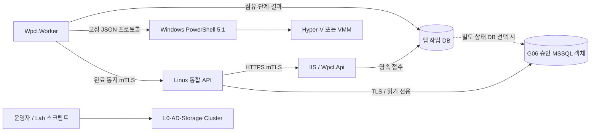

# 폴더·배포·의존 구조

[참조 안내](README.md) · [모듈 책임](modules.md) · [통신 계약](contracts.md)

## 배포 단위

| 실행 단위 | 초기 Compute 시험 | VMM 편입 후 | 권한 |
| --- | --- | --- | --- |
| Wpcl.Api | Compute IIS | VMM/SQL VM IIS | 인증서·설정 읽기, 요청 접수·조회. VM 제어 권한 없음 |
| Wpcl.Worker | Compute Windows Service | VMM/SQL VM Windows Service | 작업 실행·관측·DB 기록·완료 통지. 필요한 VMM 권한 |
| PowerShell bridge | Worker가 고정 스크립트를 호출 | 같은 방식, VMM 모듈 환경 | Worker 신원 상속. 임의 권한 상승 없음 |
| Lab 운영 스크립트 | 운영자가 L0/대상 Windows에서 실행 | 모드 전환·AD·Storage·Cluster·이관 | 승인된 유지보수 계정. API에서 실행 불가 |
| 작업 DB | 로컬 SQLite 추천 | 별도 SQL 앱 DB 추천 | API/Worker/배포자/조회 계정의 역할 분리 |
| Cloud 서비스 | 별도 프로젝트 | L0의 Linux4 | Windows가 회원·UI·MySQL을 직접 구현하지 않음 |

초기 IIS를 옮길 때 API·Worker 두 실행원을 동시에 활성화하지 않는다. 기존 작업을 비우거나 중단 상태를 원장으로 인계하고 이전 서비스·인증서·허용 주소를 제한한다.



## 목표 폴더 tree

아래는 **생성 예정 구조**다. 이번 작업으로 존재하는 것은 AGENTS와 문서다. 단계가 시작될 때 필요한 프로젝트·폴더만 생성한다.

```text
windows-private-cloud-lab/
├─ AGENTS.md
├─ README.md
├─ Wpcl.slnx                         # .NET 프로젝트가 생길 때 생성
├─ global.json                       # 검증한 SDK 고정
├─ Directory.Build.props             # nullable·분석기·공통 빌드 규칙
├─ Directory.Packages.props          # NuGet 중앙 버전
├─ .editorconfig
├─ .gitignore
├─ apps/
│  ├─ Wpcl.Api/
│  │  ├─ Program.cs                  # DI·설정·보안 조립만
│  │  ├─ Endpoints/V1/               # Jobs, Inventory, Health
│  │  ├─ Authentication/
│  │  ├─ Middleware/
│  │  └─ appsettings.json            # 비밀 없는 기본값
│  └─ Wpcl.Worker/
│     ├─ Program.cs
│     ├─ Services/                   # QueueRunner, Reconciler, OutboxDispatcher
│     └─ appsettings.json
├─ src/
│  ├─ Wpcl.Contracts/
│  │  ├─ V1/                         # Commands, Receipts, Completion, Errors
│  │  └─ Bridge/V1/                  # C#↔PowerShell 입력/결과
│  ├─ Wpcl.Domain/
│  │  ├─ Catalog/                    # 허용 profile/image/network
│  │  ├─ Jobs/                       # 전이·시도·재실행 정책
│  │  ├─ VirtualMachines/            # VM 상태·변경 정책
│  │  └─ Failures/                   # 안정적인 오류 코드
│  ├─ Wpcl.Application/
│  │  ├─ Catalog/
│  │  ├─ Jobs/                       # Accept, Claim, Execute, Reconcile
│  │  ├─ VirtualMachines/            # Plan, Verify, Cleanup
│  │  ├─ Inventory/                  # 관측·신선도
│  │  ├─ Completion/                 # 통지 생성/전달 정책
│  │  ├─ ReadModels/                 # 승인 조회 객체의 투영
│  │  ├─ Ports/                      # 저장·실행·시계·신원 경계
│  │  └─ Behaviors/                  # 공통 검증·감사·트랜잭션 경계
│  └─ Wpcl.Infrastructure/
│     ├─ Persistence/
│     │  ├─ Common/                 # entity mapping·저장 port 구현
│     │  ├─ Sqlite/Migrations/
│     │  └─ SqlServer/Migrations/
│     ├─ Execution/
│     │  ├─ PowerShellBridge/
│     │  ├─ HyperV/
│     │  └─ Vmm/
│     ├─ CompletionHttp/
│     ├─ Security/
│     ├─ Observability/
│     └─ Configuration/
├─ powershell/
│  ├─ bridge/Invoke-WpclOperation.ps1 # 고정 입력·허용 작업 dispatcher
│  ├─ modules/
│  │  ├─ Wpcl.Common/               # 경로·결과·설정 검증
│  │  ├─ Wpcl.HyperV/               # 초기 VM 실행·관측
│  │  ├─ Wpcl.Vmm/                  # 서비스 VM 실행·Job 조회
│  │  ├─ Wpcl.Images/               # 원본·복제·초기화
│  │  ├─ Wpcl.Host/                 # L0 모드·자원·전원
│  │  ├─ Wpcl.Directory/            # AD·DNS·시간
│  │  ├─ Wpcl.Storage/              # SMB·디스크·Storage 실습
│  │  └─ Wpcl.Cluster/              # Compute·전환 점검
│  └─ entrypoints/                  # 운영자용 점검·배포·전환·복구
├─ contracts/
│  ├─ openapi/                      # 실제 서비스의 버전별 명세
│  ├─ schemas/                      # 외부·bridge·로그·evidence JSON schema
│  └─ compatibility/                # Cloud 기준 hash·차이·합의한 mapping
├─ fixtures/
│  ├─ reference-flows/              # RF01~RF08 입출력·기대 상태
│  └─ images/                       # 이미지 메타데이터 예시만
├─ config/
│  ├─ examples/                     # 비밀 없는 역할별 설정
│  └─ schema/                       # 환경·profile·정책 검사
├─ deploy/
│  ├─ iis/                          # site·app pool·인증서 설정
│  ├─ windows-service/              # service 신원·복구·로그 ACL
│  ├─ database/                     # 승인 migration·권한·조회 객체
│  └─ manifests/                    # 설치/배포 artifact·해시
├─ tests/
│  ├─ Wpcl.UnitTests/
│  ├─ Wpcl.ContractTests/
│  ├─ Wpcl.IntegrationTests/
│  ├─ powershell/                   # Pester
│  └─ lab/                          # 명시적으로 선택하는 실호스트 시험
├─ tools/                           # 빌드·검증·증거 마스킹·내보내기
└─ docs/
   ├─ implementation-plan.md
   ├─ plan.md                       # 과거 초안
   ├─ pmt-docs/                     # 현재 참조 문서
   ├─ decisions/                    # 향후 repo 설계 변경 요약·PMT ID 연결
   ├─ operations/                   # 향후 검증된 설치·복원 절차
   └─ ui/                           # 기존 목업, 실제 UI는 Cloud
```

PowerShell 모듈은 해당 디렉터리에 `.psd1`, `.psm1`, `Public/`, `Private/`를 둔다. 작은 모듈은 두 파일로 시작하며 내부 파일 분리는 필요할 때 한다. `tools`에 VM 업무 코드를 숨기지 않는다.

## 프로젝트 참조 방향

| 프로젝트 | 허용 참조 | 금지하는 참조 |
| --- | --- | --- |
| Contracts | 기본 타입·직렬화 계약 | Domain·Application·Infrastructure·DB |
| Domain | 기본 타입 | HTTP·EF Core·PowerShell·외부 서비스 |
| Application | Domain, 필요한 Contracts, 추상 로깅 | Infrastructure 구현·IIS·cmdlet |
| Infrastructure | Application ports, Domain, Contracts | API/Worker 앱 |
| API | Application, Contracts, Infrastructure의 조립 등록 | endpoint에서 DB/cmdlet 직접 사용 |
| Worker | Application, Infrastructure의 조립 등록 | 새로운 업무 상태 규칙의 독자 구현 |

`Infrastructure`는 초기 한 assembly 안의 폴더로 둔다. backend별 프로젝트 분리는 런타임·배포·테스트 요구가 다를 때 한다. `Common`, `Utils`에 업무 규칙을 모으지 않고 소유 모듈에 둔다. 한 모듈이 다른 모듈의 내부 테이블을 직접 수정하지 않는다.

## 실행 데이터 위치

배포 기본안은 `%ProgramFiles%\Wpcl\releases\<release>`에 읽기 전용 실행 파일, `%ProgramData%\Wpcl\<environment>`에 설정·DB·로그·증거다. 이는 예시 경로이며 실제 드라이브는 G01에서 정한다.

```text
<runtime-root>/
├─ config/                 # 역할별 비공개 설정, 비밀 참조
├─ state/                  # 초기 SQLite와 잠금·원장
├─ logs/api/               # API 인스턴스별 JSONL
├─ logs/worker/            # Worker 인스턴스별 JSONL
├─ logs/operations/        # 운영 스크립트 로그
├─ evidence/<run-id>/      # 실제 원본, ACL 적용
├─ staging/<invocation-id>/# 제한된 임시 파일·실행 메타데이터
└─ exports/                # 검증된 마스킹 결과
```

인증서 개인키는 Windows 인증서 저장소와 필요한 계정 ACL을 사용한다. 오프라인 CA 키는 이 경로·Git·실습 호스트에 두지 않는다. VM·VHDX·백업 저장 경로는 별도 용량 계획을 따른다. 실행 데이터의 삭제·보존은 [운영 규칙](logging-and-operations.md)을 따른다.
