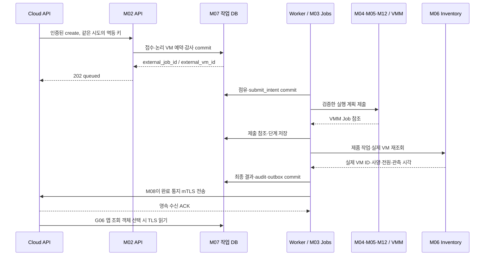
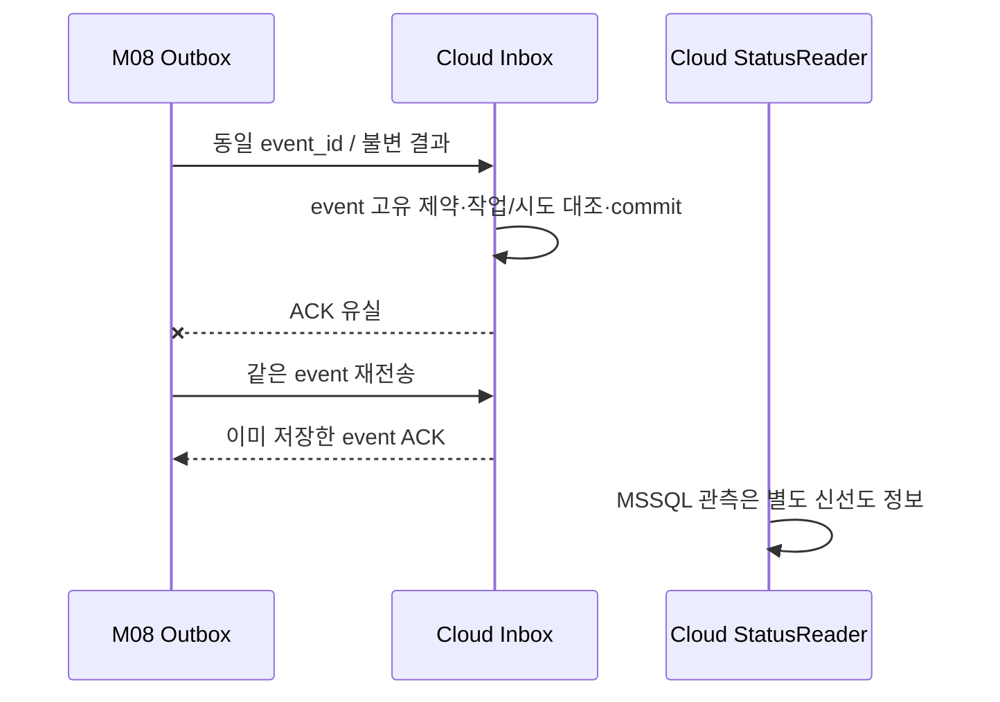

# 모듈 동작 레퍼런스

실제 구현 전의 **기대 동작**이다. 아래 RF별 입력·전이·기대 기록을 향후 `fixtures/reference-flows`와 계약/통합 시험으로 옮긴다. [통신 계약](contracts.md) · [검증 규칙](coding-and-testing.md)

## RF01 — 정상 생성

G06에서 다른 원천을 택하면 마지막 SQL 읽기는 해당 원천으로 간다. 게스트 SSH 준비는 VM 생성·전원 확인과 별도 관측이며 P14에서 실제 고객 공개키로 확인한다.

**기대:** 논리 접수 1개, 실제 VM 1대, 제품 Job 참조, 최종 원장과 outbox, Cloud 표시·실제 사양의 일치. 상세 로그가 없어도 원장에서 접수·실행·완료를 추적할 수 있다.

## RF02 — 접수 응답 유실·중복 요청

1. M02가 접수를 commit했지만 Cloud가 202를 받지 못한다.
2. Cloud가 같은 `external_idempotency_key`·같은 의미의 본문으로 재전송한다.
3. M03은 고유 제약과 본문 해시로 기존 접수를 반환한다. 새 VM 예약·실행을 추가하지 않는다.
4. 같은 키에 다른 operation/profile/attempt가 오면 409와 감사 기록을 남긴다.

**기대:** 동시 재전송도 같은 external ID를 받는다. 객체 key 순서 차이가 해시에 영향을 주지 않게 정규화 규칙을 고정한다. 필드 의미를 변경하는 정상화는 금지한다.

## RF03 — 제출 직후 Worker 중단·결과 불명확

1. M03이 submit_intent를 저장하고 M05가 VMM에 제출한다.
2. VMM Job ID 저장 전에 Worker가 종료된다. lease가 만료된다.
3. 새 Worker는 recovering으로 들어간다. 기존 bridge 프로세스·기록·요청 표식·제품 Job·VM을 조회한다.
4. 이미 존재하면 참조를 연결하고 관측을 계속한다. 제출 안 됐다는 증거가 있으면 승인 정책에 따라 제출한다.
5. 어느 쪽도 입증하지 못하면 needs_attention으로 남기고 해당 VM·용량 예약을 유지한다.

**기대:** 단순 lease 만료·프로세스 timeout이 두 번째 생성으로 이어지지 않는다. C# 저장 재시도와 제품 명령 재시도는 분리된다.

## RF04 — 부분 생성 실패·복구

1. 이미지 복사는 성공했으나 VM 설정 단계가 실패한다.
2. M05는 이 invocation이 만든 파일·VM ID와 완료된 단계를 반환한다.
3. M04는 G08 정책에 따라 자동 정리 가능/보존/운영자 조치로 나눈다.
4. 정리는 경로 루트·참조·소유 표식을 다시 확인한다. 이미 공유 중인 이미지·기존 VM은 건드리지 않는다.
5. M03이 실패 근거·잔여 자원·cleanup 상태·통지를 저장한다.

**기대:** 실패가 성공으로 표시되지 않으며 잔여 자원은 정확히 목록화된다. 복구 실패도 원래 오류를 덮어쓰지 않는다.

## RF05 — 통지 유실·중복·역순

Cloud 외부 ID mapping보다 통지가 먼저 오면 Cloud inbox가 보류한다. 같은 event ID의 다른 본문은 충돌로 격리한다. 이전 attempt 결과나 삭제 후 늦은 생성 결과로 최신 상태를 덮어쓰지 않는다. 누락 callback은 SQL 관측만으로 자동 완료하지 않고 재통지/명시적 조정한다.

**기대:** 업무 반영은 한 번, 네트워크 전송은 여러 번일 수 있다. 인증서 오류는 경보·보류이며 새 VM 실행 원인이 아니다.

## RF06 — 전원·사양 변경·삭제 충돌

1. 시작 요청을 M03이 VM별 점유하고 M04가 현재 Off 상태를 확인한다.
2. 같은 VM 삭제/resize가 들어오면 대기 또는 충돌 거부 중 승인 정책을 적용한다. 초기는 충돌 거부를 추천한다.
3. 변경 후 M06이 실제 상태를 확인한다. timeout이면 재관측하고 임의 성공 처리하지 않는다.
4. 삭제는 바인딩·실행 중 Job·디스크 공유·보존 정책을 확인한 뒤 실행한다.
5. 삭제 tombstone·주소 해제·최종 통지를 기록한다. 같은 삭제의 재전송은 기존 결과를 반환한다.

**기대:** 작업 순서·동시성 때문에 삭제된 VM이 재시작되거나 같은 디스크를 다른 작업이 지우지 않는다. CPU/RAM·디스크·게스트 용량·네트워크의 완료 검사는 동작마다 다르다.

## RF07 — Storage/Compute 8→4 보존 전환

1. M11이 유지보수 모드로 전환하고 M03 접수·실행·통지 현황을 고정한다.
2. 고객 VM 정상 종료→일관된 복구본→독립 디스크/SMB 목적지 검증을 수행한다.
3. 구성·VHDX·게스트 데이터·ID·주소를 복사하고 검증한다. S2D 풀의 파일만 남긴 채 다른 노드를 끄지 않는다.
4. 독립 Compute에서 VM을 등록하고 VMM/Windows binding·조회 모델을 갱신한다.
5. 부팅·사양·SSH·게스트 데이터 대조 후 추가 Compute/Storage를 종료·자동 시작 제한한다.
6. 물리 호스트 재부팅 후 4대와 고객 데이터 유지 여부를 확인한다. 실패 시 미리 검증한 복구 지점으로 돌아간다.

**기대:** 파일 복사 완료만으로 이관 성공을 선언하지 않는다. 양쪽에서 같은 VM이 동시에 기동하지 않으며 기존 외부 논리 ID는 보존하고 실제 ID 변경은 mapping 이력으로 남긴다.

## RF08 — 인증서 교체·로그 저장 장애

1. M09가 새 인증서의 주체·체인·용도·등록 신원·키 ACL을 점검한다.
2. 정한 교체 기간에 신뢰/바인딩/발신 인증서를 순차 갱신하고 허용·거부 시험을 수행한다.
3. 이전 인증서 폐기·신뢰 철회 후 이전 신원의 호출이 거부되는지 확인한다.
4. 별도 시험에서 JSONL 저장 공간을 제한해 M10 경보·Windows Event Log fallback·로그 손실 계측을 확인한다.
5. 작업 원장·감사를 쓸 수 없으면 신규 변경은 접수하지 않는다. 이미 외부에 제출한 작업은 관측·복구 대상으로 보존한다.

**기대:** 진단 로그 일부 실패와 영속 원장 실패의 대응이 다르다. 로그 장애가 요청 재실행·정리 데이터 삭제로 이어지지 않는다.

## fixture 작성 규칙

각 RF에는 initial state, 요청 의미, 서비스 신원, fault injection 위치, 예상 HTTP/bridge 결과, DB 최종 상태, 실제 자원 증거, 금지 결과를 둔다. ID·시각은 결정적으로 생성하고 비밀·실제 IP를 넣지 않는다. Cloud mock과 Windows 구현이 같은 내부 코드를 공유해서 자기 검증하지 않도록 독립 기대값으로 만든다. 원장·제품 Job·실제 VM을 함께 검증하는 실호스트 시험은 별도 증거로 기록한다.
